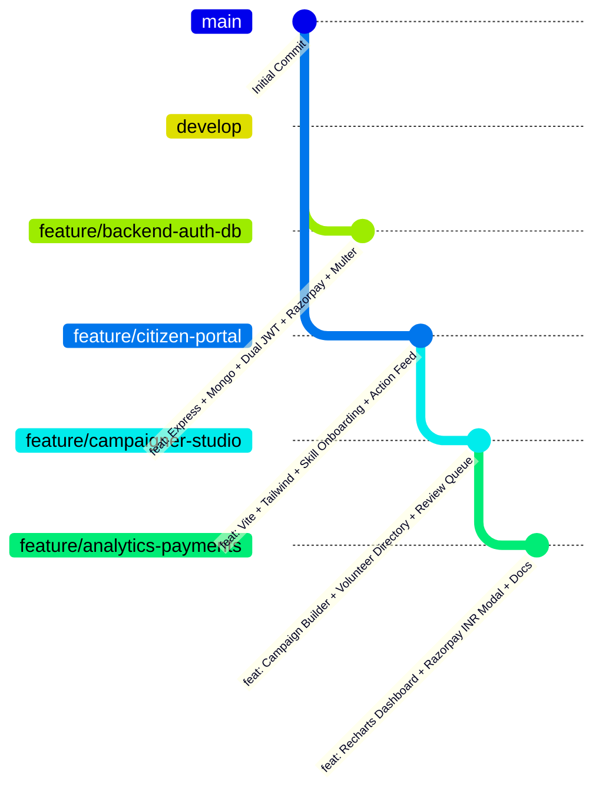

# 🇮🇳 CitizenHub: Decentralized Civic Mobilization & Volunteer Platform

> **Engineered for the Jhatkaa.org Mobilization Problem Statement**  
> A high-throughput MERN stack civic mobilization platform designed to convert passive digital signers into active, on-ground volunteers through skill-matched tasks, 48-hour accountability timers, proof verification, and single-currency (INR) contributions.

---

## 👥 4-Person Engineering Team Division & Git Roles

To simulate a real-world engineering team and maintain clean separation of concerns, CitizenHub was developed across 4 specialized roles with independent feature branches:



| Member | Engineering Role | Git Branch | Core Responsibilities & Deliverables |
| :--- | :--- | :--- | :--- |
| **Member 1 (Alex)** | **Backend & Platform Lead** | `feature/backend-auth-db` | REST API architecture, MongoDB Mongoose schemas (`User`, `Campaign`, `Task`, `Donation`), Dual-Token JWT auth (15m Access + 7d Refresh), 48-hour auto-release background worker, Multer photo proof pipeline, Razorpay order/verify backend. |
| **Member 2 (Priya)** | **Citizen UX Lead** | `feature/citizen-portal` | React + Vite + Tailwind CSS design system, Axios auto-refresh interceptor, 3-step skill onboarding wizard, personalized Action Feed, 48-hour task claim countdowns, 1-click petition signing, My Impact hub. |
| **Member 3 (Rohan)** | **Campaigner & Admin Lead** | `feature/campaigner-studio` | Super Admin organizer verification portal (strict manual approval, zero invite codes), Modular Campaign Builder (toggle petition, task, donation blocks), Volunteer Directory with multi-skill and city filters, Task Proof Review Queue with reliability scoring (+10 pts). |
| **Member 4 (Ananya)** | **Analytics & Payments Lead** | `feature/analytics-payments` | Recharts interactive data visualizations (city mobilization density, skill breakdown donut, weekly mobilization growth), Single-Currency (₹ INR) Razorpay donation modal (zero tax overhead), platform telemetry, and system documentation. |

---

## 🚀 Key Architectural Innovations

### 1. Dual-Token Authentication & Admin Verification
- **15-Minute Access Tokens** + **7-Day Refresh Tokens**: Stored securely in database and refreshed transparently via Axios interceptors on `401 Unauthorized`.
- **Zero Invite Code Guarantee**: To prevent spam and maintain trust, all Campaigner signups are queued in `pending_approval` until vetted by a Super Admin via the Admin Portal.

### 2. 48-Hour Task Hoarding Prevention
- Claimed tasks trigger an automatic **48-hour countdown**.
- If photo or URL proof is not uploaded within 48 hours, the backend releases the task back into the open pool, preventing inactive users from blocking urgent campaign actions.

### 3. Proof Verification & Reliability Scoring
- Volunteers submit photo proof (stored via Multer / Cloudinary) and execution descriptions.
- Campaigners review submissions in the **Task Review Queue**, approving valid actions (+10 reliability points, badge unlocks) or requesting revisions with feedback.

### 4. Single-Currency (INR) Direct Contributions
- Fulfilling the brief for frictionless Indian citizen giving: **Strictly INR (₹)** payments via Razorpay (UPI, Google Pay, NetBanking, Debit/Credit cards).
- Zero tax computation overhead for straightforward compliance and high conversion.

### 5. Movement Telemetry & Visual Analytics
- Real-time **Recharts** dashboard aggregating:
  - Top cities across India by volunteer density.
  - Distribution of volunteer skills (Legal, Social Media, Translation, Ground Organizing).
  - Weekly cumulative growth curve comparing signers vs active volunteers.

---

## ⚡ 1-Click Hackathon Demo Credentials

The login portal includes **Quick Demo Login buttons** to test any role with a single click:

| Role | Email | Password | Access Privileges |
| :--- | :--- | :--- | :--- |
| 🧑‍💼 **Citizen / Volunteer** | `priya@citizenhub.dev` | `Citizen@123` | Action Feed, Skill Matching, Claim Tasks (48h timer), Upload Proof, My Impact Hub |
| 📢 **Campaigner (Approved)** | `rohan@climateaction.org` | `Campaigner@123` | Campaign Builder, Volunteer Directory, Task Review Queue |
| 🛡️ **Super Admin** | `admin@citizenhub.dev` | `Admin@123` | Admin Approvals (approve/reject new campaigners), Platform Overseer |

---

## 🛠️ Tech Stack

- **Frontend**: React 18, Vite, Tailwind CSS, Lucide React, Recharts, Axios, React Router DOM
- **Backend**: Node.js, Express.js, MongoDB, Mongoose, JSON Web Tokens, bcryptjs
- **Integrations**: Razorpay (INR single currency payments), Multer (Local & Cloudinary photo uploads)

---

## 📦 Quick Start Instructions

### 1. Prerequisites
- Node.js (v18+)
- MongoDB running locally (`mongodb://localhost:27017/citizenhub`) or MongoDB Atlas URI

### 2. Backend Setup
```bash
cd server
npm install
npm run seed     # Seeds demo campaigns, volunteers, tasks, and admin users
npm run dev      # Starts API on http://localhost:5000
```

### 3. Frontend Setup
```bash
cd client
npm install
npm run dev      # Starts Vite on http://localhost:3000
```

---

## 🌿 Git Branch Merging Workflow

Once all 4 member feature branches are reviewed:
1. Merge all features into the integration branch (`develop`):
   ```bash
   git checkout develop
   git merge feature/backend-auth-db
   git merge feature/citizen-portal
   git merge feature/campaigner-studio
   git merge feature/analytics-payments
   git push origin develop
   ```
2. Promote `develop` to `main`:
   ```bash
   git checkout main
   git merge develop
   git push origin main
   ```
